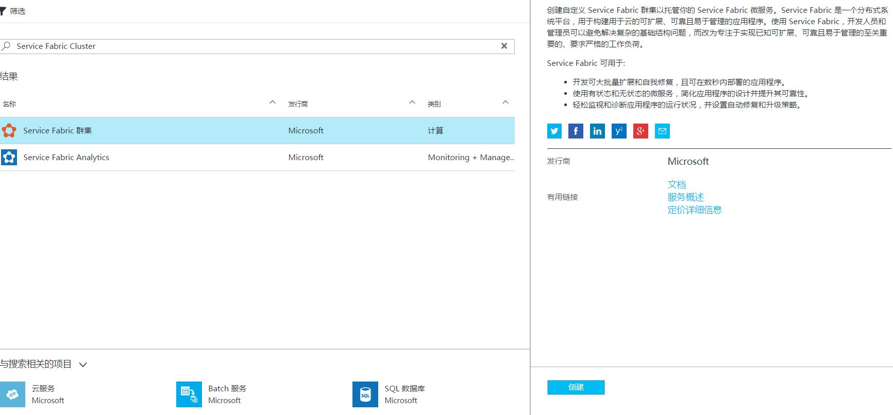
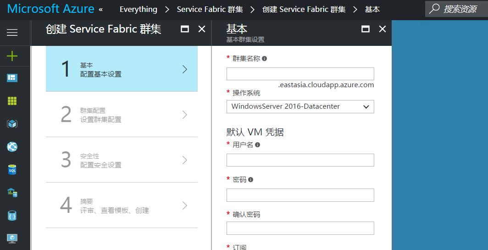
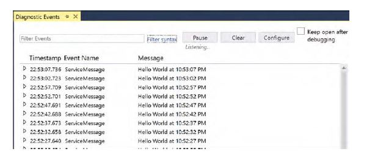
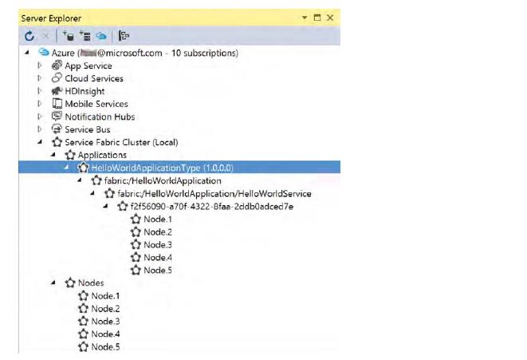
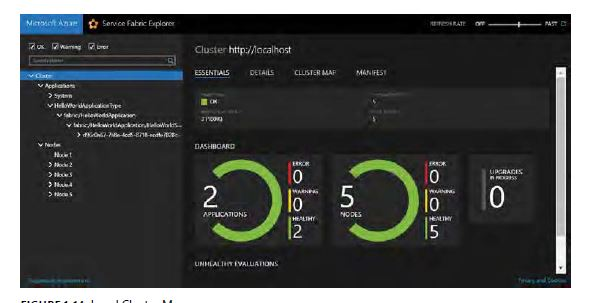
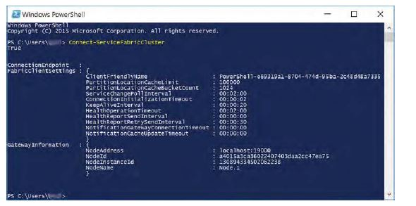

# 第一章: Hello, Service Fabric

这是一本关于微软Azure Services Fabric的书。微软的Azure Services Fabric是一个分布式系统平台，它能让我们轻松的创建大规模，高可用，低延迟和易于管理的服务。Service Fabric的技术也在一些云级别的应用中得到了应用，如Cortana, Skype for Business和SQL databases。在Azure Services Fabric提供的下一代分布式计算的基础上，我们可以轻松地设计，实现，扩展和管理我们的服务。

在开始了解Service Fabric之前，让我们想想一个优秀的平台即服务（PaaS）需要包含哪些要素？为什么我们需要一个全新的平台即服务（PaaS）来创建下一代基于云的服务。

## 一个现代的PaaS
PaaS从设计时就需要考虑敏捷性，可扩展性，可用性以及性能。微软Azure Service Fabric是一个以支持大规模，高可用的云应用为目标而从头开始构建的PaaS。

### 专注于敏捷
软件产业的一切都和敏捷相关。开发人员希望在一个没有物理约束的虚拟世界中工作，创新能够以其它领域无法想象的速度发生。 作为这样一个群体，我们一直在不懈的追求速度：从软件框架，自动化工具，从增量开发到Heroku的12系数法（Wiggins 2012），从最小可行的产品（MVP）到持续交付。敏捷的首要目的就是为了开发人员能够持续的创新和提高。

#### 微服务
微服务的本质是把复杂的应用分解为独立的服务。每个服务是一个独立的，完整功能的单元，它可以在不影响其它服务的情况下演化或是重构。

所有的软件都可以抽象成为组件和组件间的通信。单体软件很难维护或修改，而过度的分解又导致系统难于理解，同时不同组件之间复杂的交互又会带来不必要的开销。因此在很大程度上，软件架构的艺术是要在组件数量和组件通信路径数量之间寻求一个平衡点。

为微服务而设计的Paas应该鼓励关注点隔离，强调松耦合，并提供灵活的组件间通信机制。尽管Service Fabric允许选择其它的架构，但是Service Fabric是为微服务而设计并推荐使用微服务。 Service Fabric应用是由一系列服务组成，每个服务是一个可修改，扩展和管理的独立组件；同时整个应用可以被作为一个完整的逻辑单元来管理。在本书的第二章“无状态服务”，第三章 “有状态服务”和第四章“Actor模式”将会讨论Service Fabric应用的设计。 在本书的第三部分，我们会查看几个典型的应用的模式和场景。

> __注意：架构选择__
> 
> 虽然推荐使用微服务，但并不是强制的。 也可以选择使用其它架构：如N层体系架构，数据为中心的架构，和单层Web应用或API。

#### 简单
PaaS平台不仅仅是资源调度和应用托管，它还需要为开发人员的开发工作提供实际的支持。 最基本的，PaaS平台为开发人员提供一些通用的支持，如日志，监控和事务处理。更进一步，Paas平台还需要提供高级的非功能性的设施，如服务发现，容错，复制和负载均衡。所有这些非功能性设施都是一个可扩展和高可用系统必不可少的。这些内置的非功能性设施将会极大的提高开发效率。PaaS提供了这些基础设施后，开发人员可以专注于构建核心业务逻辑。当我们读完本书后，我们会看到Service Fabric是如何让我们专注于业务逻辑的开发，并在我们需要的时候直接可以使用这些功能。

更进一步，如果PaaS平台能够提供一个易用的编程模型帮助我们处理复杂的问题又会怎样？如果PaaS平台还能够为典型的应用场景提供开发指导和开发模式又会怎样了？ 在第二，第三和第四章的服务类型中我们会继续讨论这些问题。

#### 复杂应用的生命周期管理
持续改进是敏捷软件运动和各行各业精益理论的核心，迭代的速度越快，浪费就会越少，创新和创造附加价值的速度也就越快。成熟的PaaS平台必须提供的完善的应用生命周期管理（ALM）功能，以保持创新的发动机可以无障碍的运转。

现在越来越多的公司采用持续交付，软件正在以比过去更快的速度发布。很多公司每天都会有成百上千的部署，这需要自动化测试，持续集成，快速部署，可靠的版本管理和快速回退的支持。只有当PaaS平台提供了所有这些功能，开发人员和独立软件开发商（ISV）才能实现持续交付。

对于运维来说，一个完善的生命周期管理策略是至关重要的。如果我们仔细观察，我们会发现许多所谓的开发和运维之间的矛盾来源于不同环境的差异。像Service Fabric这样的PaaS平台允许应用被打包成自包含的包，这个自包含的包可以一致的部署到不同的环境中，例如开发，测试，质量保证和生产环境中。
本书的第二部分会专门讨论应用的生命周期管理。

### 专注服务质量
一个成功的云服务必然要求服务开发者和云平台之间有良好合作关系。服务开发者带来业务专长和创新，而云平台提供服务质量（QoS）：如可扩展性，可用性和可靠性。

#### 可扩展性
通过创新，我们可以做前所未有的事情。然而，问题复杂性的不断增加需要开发人员不断的改进方法来保持前进的势头。为了让应用在无需开发人员花费很大代价的情况下能自然的进行扩展，PaaS平台在设计时就应该充分考虑可扩展性。

> __不断增的加复杂性和规模__
>
> 不断增的复杂性可以很容易地用一些事实说明。 据“美国航空航天局关于飞行软件复杂性的研究“（NASA Office of Chief Engineer, 2009 ），飞行软件的复杂性大约每10年就会以10为增长率的指数级增加。1968年的阿波罗8号有8500行代码，而1989年运行的国际空间站（ISS），拥有150万行代码。
> 
> 除了软件的复杂性，数据的量也导致一系列新的问题。 据Twitter统计（公司概况 https://about.twitter.com/company ），Twitter 每天处理5亿条消息。 如此规模的数据导入，转换，存储和分析是一个前所未有的挑战。 现代的服务也需要处理潜在的快速增长。 在过去五年左右的时间里，微软Azure存储已经成长为一个每天要处理777万亿事务的服务（查尔斯·巴布科克，微软Azure：更成熟的云平台，信息周刊9月30日，2015年， http://aka.ms/asf/maturecloud ）。

在云平台上，通过增加主机的处理能力来扩容并不太可取。典型情况下，虚拟机按照预先配置的处理能力创建，为了扩容，需要迁移工作负载到一个更强处理能力的虚拟机上。 这是一个漫长而又破坏性的过程，在这个过程中服务需要被关闭，迁移和重新在新的虚拟机上运行。在这个过程中提供的服务也会被中断。另外，由于可选择的虚拟机处理能力也是有限的，可用的容量也会很快用完。尽管Azure提供大量不同处理能力的虚拟机，包括云上最强大的虚拟机，但是大规模的负载任然可以超过任何单台机器的处理能力。

相反的，可以通过增加更多的服务实例来来承担工作负载，从而动态的扩展系统容量。因为不需要关闭已有的服务，这种类型的扩展不会影响已有的服务。理论上，由于可以添加足够多的服务实例直到满足我们需求，所以系统容量可以无限的扩展。

通常，有两种基本的方法完成负载的分配，一种是在所有可用的实例上均匀的分配负载；另一种是分割单个负载到不同的服务实例上。Service Fabric支持这两种负载分配方式，我们将在第七章“可扩展性和性能”中详细讨论。

#### 可用性
可用性通常是通过冗余来实现，当服务出现故障时，备份服务接管当前服务并保持业务的连续性。虽然这个想法听起来很简单，但在具体实施中就会遇到很多困难。例如，当某个服务出现故障，它本地维护的状态该怎么处理？ 如何确保替代服务可以恢复这些状态并重新开始这些可能是在任意位置中断的服务？在另一方面，如果在不关闭现有服务的情况下执行更新？ 如果新版本出现问题，如何安全的回退到前一个版本？这些问题的解决方法会涉及很多方面，例如，健康监测，故障检测，故障转移，版本管理和状态复制。只有一个精心设计的PaaS平台才能协调所有这些功能来提供一个完善的直观的的可用性解决方案。可靠性和可用性是第6章讨论的主题。

#### 可靠性
系统故障将会降低可靠性。然而，在大规模分布式系统中，监测， 跟踪，诊断问题经常是一个很大的挑战。如果PaaS的没有一个强大的健康子系统来监控，报告和响应可能的系统和应用级别的问题，检测和修复这些系统缺陷将变的非常困难。

在第六章中我们会研究Service Fabric在可靠性方面提供的功能。

## 工作负载和基础设施的隔离
云时代带来了新机遇的同时也带来了新挑战。云基础架构即服务（IaaS）带来了一个好处，即它屏蔽了物理或虚拟硬件管理的复杂性。但这仅仅是一个起点，为了充分享受云计算带来的好处，我们需要PaaS帮助我们完全隔离这些基础设施的存在。对于一个程序运行而言，所需要的是一些计算和存储资源：诸如CPU，存储器和磁盘空间。我们真的需要关心哪个主机提供了这些资源吗？程序在其整个生命周期都在同一台主机上运行真的重要吗？程序运行在本地服务器或者云上有什么不同吗？像Service Fabric这样的一个现代PaaS在工作负载和基础设施之间提供了一个清晰的隔离，它会自动管理资源池，根据应用程序的需要来查找并分配资源。
 
> __配置约束__
>
>有时，我们关心在应用的组件如何在PaaS的集群部署。例如，如果我们的集群包括多个不同处理能力的节点类型，我们可能希望部署某些组件到特定的节点。我们可以通过定义配置约束来实现应用的不同组件部署到特定的节点；另外，如果我们想最小化两个频繁交互组件间的延迟，我们可以建议PaaS保持这些组件物理上邻近来实现；而在有些情况下，我们可能想让组件尽量的分散以避免单个主机故障的情况下不至于所有的组件都失效。在本书的稍后部分我们将讨论配置约束。

清晰的隔离带来一系列显著的好处。 首先，它使得当需要的时候工作负载可以从一台主机转移到另一个主机。当一台主机故障的情况下，故障主机上的工作负载能够迅速的迁移到另外一台健康的主机，从而实现快速的故障转移； 第二，不相关的负载可以互不干扰的被部署到相同的主机，从而提高的计算密度；第三，运行和销毁应用实例通常比启动和关闭机器更快，系统容量可以通过动态的扩展来匹配工作负载的变化；第四，隔离也使得程序可以在没有平台禁锢下被架构，开发和运营。我们可以在本地或云上运行相同的应用，只要这些环境都提供了相同调度CPU，内存和磁盘资源的机制。

## Service Fabric的概念
在本节中，我们首先简要了解一下Service Fabric的架构。然后，学习一些Service Fabric的关键概念，为Service Fabric服务开发做准备。

### 架构
图1-1描述了Service Fabric顶层架构。正如我们所看到的，Service Fabric是由许多子系统构成的一个复杂的PaaS平台。本节会对这些子系统进行简要的描述。后面我们会对每一个子系统进行详细的讨论，如果现在对其中一些术语不太熟悉也不用太担忧。

图1-1中包含以下子系统：

+ __传输子系统__   传输子系统是Service Fabric的一个内部子系统，它为Service Fabric集群之间，以及Service Fabric集群和客户端之间提供安全的点到点的通信信道。
+ __联邦子系统__   联邦子系统提供故障检测，领导人选举，和一致的路由，这些是构建一个统一的集群的基础。我们接下来的章节将会对这些术语有更多的讨论。
+ __可靠性子系统__ 可靠性子系统管理状态复制，故障转移和负载均衡。这些都是一个高可用和高可靠系统必须具备的。
+ __管理子系统__ 管理子系统提供完善的应用生命周期管理，包括管理应的二进制文件，部署应用，更新应用，销毁应用，以及监控应用的健康状态。
+ __托管子系统__ 托管子系统负责管理集群节点上应用的生命周期。
+ __通信子系统__ 通信子系统的主要任务是服务发现。由于工作负载和基础设施是完全隔离的，服务实例可以从一个主机迁移到另一个主机。通信子系统为客户端提供命名服务，通过命名服务客户端可以发现并连接到服务实例。
+ __测试子系统__  Netflix的Chaos Monkey(和后来的Netflix Simian Army )使得在实际生产环境中进行测试得到了广泛的普及。测试子系统能够模拟各种失效场景，以帮助开发者发现在设计和实现中存在的各种缺陷。

### 节点和集群
要了解Service Fabric集群，我们需要了解两个概念：节点和集群。

+ __节点__   技术上，节点只是Service Fabric的一个运行时进程。在典型的Service Fabric部署中，一台就机器部署一个节点。 所以我们可以把节点理解成一台物理或虚拟机。Service Fabric集群允许同时包含不同处理能力和配置的不同类型节点。
+ __群集__  集群是互相连接节点的集合，这些互相连接的节点构成一个可以运行应用和服务的具有高可用性和可靠性的环境。Service Fabric集群可能由成百上千个节点组成。

图1-2是一个简单的Service Fabric集群的例子。所有节点都是对等节点，没有主节点或从属节点之分。另外，虽然图中所有节点被安排在一个环上，但事实上任何节点之间都可以通过传输子系统直接通信。

> __注意：节点和容器__
> 
> 除了物理机器和虚拟机外，节点可以是基于Windows的Docker容器，该功能已经在Windows Server 2016实现。在第17章“高级服务托管”中我们会对容器化进行更加细致的讨论。

Service Fabric集群在工作负载和底层基础设施之间提供了一个抽象层。 由于我们可以在物理机和虚拟机上，也可以在本地或者是云上运行Service Fabric集群 ，因此我们不需要对Service Fabric应用做修改做任何修改就可以运行在各种环境中，例如本地的数据中心和微软的Azure。

### 应用和服务
一个Service Fabric应用是一些服务的集合。服务是一个提供某些完整功能的单元。通过定义应用类型和关联的服务类型可以创建Service Fabric应用。当部署应用到Service Fabric集群时，这些类型分别被实例化为应用实例和服务实例。

在Service Fabric中应用是一个隔离的单元，在同一个集群上多个应用可以独立的被部署和管理。Service Fabric保证多个应用的代码，配置和数据彼此隔离。因此多个版本的应用可同时部署到同一个集群上。

### 分区和副本
一个服务可以有一个或多个分区。Service Fabric使用分区来作为扩展机制，以达到分配工作负载到不同的服务实例上。

一个分区可以有一个或者是多个副本。 Service Fabric使用副本达到高可用性。分区有一个主副本和多的从副本， 副本之间的状态会自动被同步。当主副本失效的情况下，从副本会自动成为主副本以保障服务的可用性。 从副本的数目会恢复到期望的水平以保证足够的冗余。

我们将在第2章、第3章和第7章中更详细地介绍分区和副本。

### 编程模式
Service Fabric提供了两个高层框架来构建应用：可靠服务API和可靠的Actor API。

+ __可靠服务API__  提供对Service Fabric结构（如可靠集合和通信栈 ）的直接访问。
+ __可靠Actor API__  提供了一个高层次的抽象，应用可以被建模成许多互相交互的参与者.

无状态和有状态服务可以被添加到Service Fabric的可靠服务API框架中。 这两种服务类型的关键区别在于服务的状态是否保存在本地机器节点上。

### 无状态和有状态
有些服务不需要维护任何跨请求的状态。 假设有一个提供加减法运算的服务 ，每次服务调用输入两个操作数并输出结果。 服务不需要维护任何两个调用之间的上下文相关的信息，每一个调用只根据输入参数进行运算。 服务的行为不受任何上下文信息影响，例如，输入5加3输出总是8；输入9减6输出总是3。

相反，大多数服务需要保持某种状态，一个典型的例子是购物车服务。当用户向购物车添加物品的时候，为了保持购物车里的物品不被丢失，购物车的状态需要在不同请求之间被保存。

不需要维护状态或者是不需要在本地维护状态的服务被称为无状态服务，需要维护本地状态的称为有状态服务。 继续以购物车为例，如果状态被保存到外部数据存储，它可以被实现成无状态服务；如果状态被保存在本地节点，它就被实现成有状态服务。

> __注意： “拥有状态（Has State）”和“有状态（Stateful）”__
> 
> 大多数服务都拥有状态。然而，这并不意味着它们是有状态的。状态服务和无状态服务之间唯一的区别是状态存储在什么地方。

有状态的服务可能会导致一些问题。当服务被扩展时，多个实例共同处理所有的工作负载。对于一个无状态服务，请求可以分配到任何一个实例上，不用关心那一个实例处理某个特定的请求。对于有状态服务，每一个实例在本地记录了它自己的状态，某个用户的会话的请求必须被路由到相同的实例，已确保一致的用户体验。有状态服务的另一个问题是可靠性，当一个服务实例失效，存储在这个服务实例上的状态也随之消失，由这个实例提供的所有用户的服务也将被中断。

为了解决这些问题， 可以通过外部化状态把一个有状态的服务转化为一个无状态的服务。 然而，这意味着每一个服务请求都会伴随着额外的外部数据访问，这将增加了系统延迟。幸运的是，Service Fabric提供了一套方法来避免这一困境，我们将在第3章讨论。

## 准备开始
要开始Service Fabric的开发，我们需要两个条件：

+ 开发环境
+ Service Fabric集群

在这一部分中，首先我们要建立一个本地开发环境，包括本地的多节点集群。我们可以在这个本地集群上部署和测试我们的应用。接下来，我们会在微软Azure上创建一个托管的Service Fabric集群。本书主要在Visual Studio 2015中使用C#进行开发，我们也会简单的介绍如何使用其它语言进行开发，如Node.js。

### 搭建开发环境
我们需要Visual Studio 2015和Service Fabric SDK来搭建开发环境，我们可以通过微软Web平台安装程序(Web PI, https://www.microsoft.com/web/downloads/platform.aspx ) 安装Service Fabric SDK。按照安装向导，并使用默认安装选项安装，本书使用2.0.135预览版。

另外，下面这些工具也需要安装：

+ 最新.NET版的微软Azure SDK（使用Web平台安装程序， 本书采用2.8.1）
+ 最新的微软Azure PowerShell（使用Web平台安装程序，本书采用1.0

Service Fabric SDK包含了一个本地多节点Service Fabric集群，我们可以在集群部署的测试我们的应用。

### 在Azure上部署Service Fabric集群
虽然我们可以使用Service Fabric SDK提供的本地的集群来做开发和测试，但我们希望部署生产环境到Azure托管的集群上。

> __注意： 订阅微软Azure__
> 
> 要使用微软Azure，我们需要订阅微软Azure。如果没有，我们可以在 https://azure.microsoft.com/pricing/free-trial/ 上申请免费一个月的试用。

我们可以按照以下步骤在Azure上创建一个新的Service Fabric集群。

> __微软Azure管理门户术语__
> 
> 当你点击门户链接登录后，右边的显示区域被称为“blades”。 另外我们也会在讨论和文章中看到下面这些术语：
> 
> __枢纽中心（Hub）__ Hub收集和显示来自多个数据源的信息。例如，通过顶部命令栏的钟形图标，我们可以让来自不同服务的信息被显示在通知中心。
>
> __仪表盘(Dashboard)__ 登陆后的主页面就是仪表盘，我们可以可以把需要经常访问的资源链接到这来这里。
> 
> __磁贴(Tile)__ 每一个被放置在仪表板上的项目称为磁贴。
> 
> __行程(Journey)__ 当我们完成一个工作流程，浏览的步骤被记录为一个行程。在顶部，我们可以看到行程的历史记录，点击任意一步来前进或后退。 行程是被自动记录的，我们可以点击微软Azure标签旁边的向下箭头来查看以前的行程，如下图所示。

1. 登录微软Azure管理门户（ https://portal.azure.com ）。
2. 点击主页左上角的新建图标，如如图1-3所示。
    
3. 在搜索应用商店中输入并搜索“Service Fabric Cluster”, 选择Service Fabric集群，一个新的Service Fabric集群就会开始创建, 如图1-4。
    
4. 在Service Fabric创建的页面上点击“创建”按钮继续，如图1-5.
    
5. 在基本信息页面，输入集群名字，输入虚拟机用户凭据，选择想使用的Azure订阅，输入新的资源组名称，选择托管集群的地理位置，然后点击确定继续。如图1-6；
    

    > __注意: Azure资源组__
    > 
    > 资源组是Azure上资源的集合，每一个资源，比如虚拟机或虚拟网络，属于一个资源组。 资源组定义了管理边界和安全边界。我们可以以资源组为逻辑单元创建或者是销毁所有资源。 我们可以应用基于组级的角色的访问控制（group-level Role-Based Access Control）策略， 这些策略将被组立的所有成员继承。

6. 点击节点类型，创建一个新的节点类型配置。在本书的后面，我们会看到更多关于节点类型的信息。在节点类型配置页，输入节点类型名，选择虚拟机类型，输入80作为“自定义终结点”的值，然后点击确定，如图1-7；
    
7. 设置安全模式为非安全模式，按照创建向导的指示完成集群的创建；
8. 创建过程会持续几分钟，一旦完成创建，我们就可以在仪表盘访问我们创建的集群了。图1-8显示集群的信息，从中我们可以找到集群的公网地址（以 <集群名>.<区域>.cloudapp.azure.com的格式 ）和端口（默认是19000）。后面我们可以用这些信息连接到集群上。

    

## Hello, World
现在是我们用Service Fabric实现一个“Hello World”应用的时候了。

> __致敬，Hello, World__
> 
> 下面的代码是我的第一个“Hello, World”， 大约27年前用BASIC写的。
> 
> 10 PRINT "Hello, World"
>  
> 20 END
> 
> 这些年我们很高兴地看到，这种简单和优雅被延续到各种新的语言和平台中。由于Service Fabric被设计来处理各种复杂的问题，我们需要继承一些平台已有的框架和结构，然而我们依然会看到“Hello World”应用只需要几行代码改动。

我们的第一个Service Fabric应用包含了一个无状态服务，每5秒钟输出一个带时间戳的"Hello World"字符串。

1. 以管理员的身份运行Visual Studio 2015.

    > __注意：以管理员身份运行Visual Studio__
    > 
    > 本机的集群需要管理员权限运行，如果我们需要在本地集群上运行和测试我们的应用，我们需要以管理员的身份运行Visual Studio。

2. 如图1-9，使用Cloud\Service Fabric Application模板创建一个名叫HelloWorldApplication的新项目。
    

3. 如图1-10，在“New Service Fabric Service”中选择无状态服务模板，输入HelloWorldService作为项目名，点击OK创建Hello World服务。

    

    现在，这个解决方案中已经用两个项目：一个是叫HelloWorldApplication的Service Fabric应用的项目，另一个是叫HelloWorldService的无状态服务项目。 后面我们会查看里面的其他部分，现在我们先看无状态服务项目的HelloWorldService类。
    
        internal sealed class HelloWorldService : StatelessService
        {
            public HelloWorldService(StatelessServiceContext context): base(context) { }

            protected override IEnumerable<ServiceInstanceListener> CreateServiceInstanceListeners()
            {
                return new ServiceInstanceListener[0];
            }

            protected override async Task RunAsync(CancellationToken cancellationToken)
            {
                long iterations = 0;

                while (true)
                {
                    cancellationToken.ThrowIfCancellationRequested();
                    ServiceEventSource.Current.ServiceMessage(this, "Working-{0}", ++iterations);
                    await Task.Delay(TimeSpan.FromSeconds(1), cancellationToken);
                }
            }
        }

4. 为了实现无状态服务，我们的服务类需要继承自StatelessService的基类。 Service Fabric不强制要求一个通信协议。 我们可以通过提供一个ICommunicationListener的实现来插入不同的通信栈，在本书中我们后面会看到许多通信栈的实现。 在当前的这个例子中，我们将跳过通信栈，这也就是说我们的服务是一个后台服务，不需要接受任何客户端请求。

5. 修改RunAsync方法来实现我们的服务逻辑。

    正如我们从下面代码段看到的，为了实现一个后台服务，所有我们需要做的就是重写RunAsync方法和构造我们自己的循环处理。

        protected override async Task RunAsync(CancellationToken cancellationToken)
        {
            while (!cancellationToken.IsCancellationRequested)
            {
                ServiceEventSource.Current.ServiceMessage(this, "Hello World at " + DateTime.Now.ToLongTimeString());
                await Task.Delay(TimeSpan.FromSeconds(5), cancellationToken);
            }
        }

    > __注意：取消标记__
    >
    > 在NET的异步编程模式中， CancellationToken结构被用来传递操作被取消的通知。 由于CancellationToken可能被传递给多个线程，线程池工作条目和任务对象，因此它可以被用来跨越这些边界协调取消操作。
    > 当一个Token的IsCancellationRequested被设置为True，与这个对象关联的任务请求取消。接受到通知时，我们需要停止继续处理。当我们的代码在调用下游的任务时，为了下游任务也需要被取消，所以我们需要传递取消标记到下游任务。正如前面代码里面Delay调用所做的。

6. Service Fabric的SDK会自动生成Windows事件跟踪（ETW）事件源的代码。如果感兴趣，可以已查看生成的ServiceEventSource类。

    > __注意：使用ETW跟踪和记录日志__
    >
    >推荐使用ETW跟踪和记录日志，ETW速度很快并对我们代码性能影响最小；另外，Service Fabric使用ETW作为内部跟踪机制，我们可以结合service fabric的日志来查看我们应用的日志，这样更加容易理解应用和Service Fabric的关系；最后，ETW可以在本地环境和云上都可以使用，因此我们可以使用相同的跟踪机制，即使是在不同的环境中。

7. 现在，可以按F5运行应用程序。 VisualStudio将启动测试群集，部署应用，并启动服务。 一旦启动服务，我们可以看到“Hello World” 在诊断事件窗口输出，如图1-11所示。
    

    > __注意： 诊断事件窗口__
    > 如果没有看到诊断事件窗口，可以通过使用View\Other Windows\Diagnostic Event Viewer菜单来打开。 

8. 在Visual Studio工具栏上单击“停止调试”或按Shift + F5停止调试 。诊断事件窗口中我们任然可以看到"Hello World"字符串任然不断的输出。 停止调试仅仅是停止了我们的调试回话，运行的服务并没有被终止。

恭喜! 我们已经实现，部署和测试了我们的第一个Service Fabric应用。 接下来，让我们来看看我们的本地集群。

## 管理本地群集
我们可以通过使用Visual Studio服务器资源管理器，云资源管理器，Service Fabric的本地群集管理器，或PowerShell来管理本地集群。在本节中，我们会查看所有的这些管理方法。

### Visual Studio 服务资源管理器
我们可以从Visual Studio的Azure节点下的View\Server Explorer菜单打开服务资源器资源管理器。在这里我们可以看到Servie Fabric集群（本地）节点，如果安装了Azure SDK，我们还可以看见其他Azure资源类型。 图1-12显示了在集群上有5个节点， “Hello World”的应用部署在这个集群上。 你可能已经注意到应用和集群节点是分开显示的，正如我们本章的前面部分介绍的，工作负载和集群资源是隔离的。

图1-12节点的视图显示了一个包含五个节点的集群。下面我们将一一解释应用视图里每一层的含义：

### 应用类型节点
最顶层是一个应用类型节点，它代表一个应用的类型，在这本例中是HelloWorldApplicationType。当我们在Visual Studio中编写应用程序代码 时，我们定义了应用程序类型。当我们在集群上部署应用时，我们就得到了一个应用的实例。这种关系和面向对象的编程（OOP）中类和实例的关系很类似。

### 应用实例节点
应用类型节点下面是应用实例的节点，它以应用名字来命名。（在本例中，fabric:/HelloWorldApplication ）。默认情况下，应用是以应用类型名称来命名。但是我们可以按照fabric:/<string>的格式来修改应用的名字。

### 服务类型节点
在应用实例节点下是服务类型节点，每个节点表示已注册的服务类型，如本例中的HelloServiceType。 在Service Fabric中每一个服务被命名为fabric:<application name>/<service name>。这个名字也是服务的地址，运行时Service Fabric内建的命名服务会解析这个名字到实际的服务实例地址。

### 分区节点
分区被GUID标示，客户端不能直接使用它来和分区通信。Service Fabric的命名服务会找到正确的分区，并把服务请求发送到分区上。

### 副本节点
图1-12显示，默认情况下，为了高可用性Service Fabric为分区维护了多个副本。在本例中，我们的Hello Service被配置为五个副本节点的单分区应用。

> __注意：副本和服务实例__
>
> 副本是一个服务实例，服务实例通常用于逻辑的描述部署的拓扑结构；当讨论明确的副本行为或概念时，术语副本被使用。

### Visual Studio云资源管理器
微软Azure SDK附带一个叫云资源管理器的VisualStudio扩展，我们可以通过View\Cloud菜单访问。在集群管理功能上，云资源管理器与服务资源管理器类似 ，如图1-13所示。

### Service Fabric管理器
无论是服务器资源管理器还是云资源管理器都被设计成一个完善的管理工具，使用它们能够轻松的浏览和查看云资源和服务器资源， 同时它们也提供有限的管理功能。

Service Fabric SDK提供了一个叫Service Fabric管理器的功能强大的工具。 可以通过浏览器访问 http://localhost:19080/Explorer 查看它的管理界面。Service Fabric管理器左侧的面板和服务器资源管理器或云资源管理器非常相似。 但是，它在右边的详情页面提供更加详细的信息。如图1-14，显示了当前选择项目的详细信息。

这本书我们会经常在不同的场景下使用这个工具。 现在，我们先熟悉一下这个工具。 在下面的练习中，我们将从集群中删除我们的Hello World应用。

1. 在Service Fabric管理器的左侧面板中选择fabric:/HelloWorldApplication节点，然后在右侧的面板中点击“Actions”, "Delete Application"菜单项，如图1-15。

    

2. 在确认删除对话框中点击“Delete Application”, 确认删除。 如图1-16所示。
    

3. UI每隔几秒会自动刷新。当UI刷新后，会看到应用实例已经被删除，如图1-17.
    

> __注意：集群重置__
>
> Service Fabric SDK会安装一个Service Fabric图标到任务栏，它提供一系列的集群操作的快捷菜单，方便我们重置集群。 点击任务栏的Service Fabric图标并选择重置集群菜单，就可以完成重置操作。

### Windows PowerShell
Windows Powershell是一个强大的自动化和配置管理框架。 Service Fabric SDK安装了许多PowerShell cmdlets以方便我们从命令行或自动化脚本中管理我们的应用和集群。

如果查看HelloWorldApplication的目录，我们可以看到Deploy-FabricApplication.ps的文件。这个脚本调用许多Service Fabric SDK目录（默认C:\Program Files\Microsoft SDKs\Service Fabric\Tools\Scripts）下内置的脚本完成部署，升级，和移除应用。

开始之前，我们打开一个新的Windows PowerShell窗口，并使用Connect-ServiceFabricCluster cmdlet连接到本地集群，如图1-18。

接下来，让我们试试更多命令，后面我们将学习更多的cmdlets.

+ 列举应用实例

    输入Get-ServiceFabricApplication，我们可以列举这个集群上的应用实例。输出入下:（如果应用实例已经被移除，在Visual Studio中按F5重新部署应用）

        ApplicationName : fabric:/HelloWorldApplication
        ApplicationTypeName : HelloWorldApplicationType
        ApplicationTypeVersion : 1.0.0.0
        ApplicationStatus : Ready
        HealthState : Ok
        ApplicationParameters : { "HelloWorldService_InstanceCount" = "-1" }

+ 列举节点这状态

    输入Get-ServiceFabricNode | Format-Table NodeName, NodeStatus，可以列举所有节点和它的当前状态:

        NodeName NodeStatus    
        -------------------
        Node.1 Up
        Node.2 Up
        Node.3 Up
        Node.4 Up
        Node.5 Up

## 附加说明
在写本书的时候，Service Fabric还是预览版，未来服务的API，工具的用法，管理界面有可能会有所变化。但是在未来的发布版本中，本书的第一和第二部分所涉及的核心概念，以及第三和第四部分的模式和适用场景应该会保持不变。

访问 https://azure.microsoft.com/documentation/services/service-fabric/ 获取最新的Service Fabric文档。
